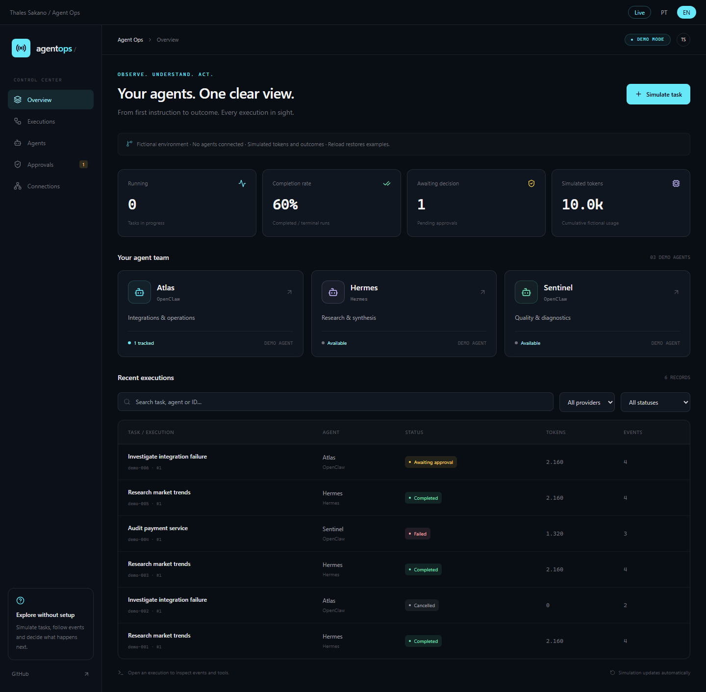

# Agent Ops

An agent operations dashboard by Thales Sakano, built with Next.js, React, TypeScript, and Tailwind.



*Dashboard preview in demo mode, with simulated data.*

- **`/` — public demo:** simulated tasks, approvals, reports, and metrics. No credentials or external execution.
- **`/live` — private monitoring:** real queries to the OpenClaw Gateway and Hermes dashboard, protected by operator login.

The Sakano Lab portfolio continues to use the demo. This standalone installation includes the live connectors.

## Getting started

Requires Node.js 22 or later:

```sh
npm ci
npm run dev
```

Open http://localhost:3000. The demo requires no configuration. For production, run `npm run build` and `npm start` on a Node server with HTTPS at the reverse proxy. Live mode requires a Node backend and does not support static export.

<a id="modo-live"></a>

## Live mode

1. Copy `.env.example` to `.env.local`.
2. Set `AGENT_OPS_PASSWORD` (at least 16 characters) and `AGENT_OPS_SESSION_SECRET` (at least 32). Use different random values. Generate each value with:

   ```sh
   node -e "console.log(require('crypto').randomBytes(32).toString('hex'))"
   ```

3. Set `AGENT_OPS_ORIGIN` to the **exact origin used in your browser**, such as `http://localhost:3000` for development or `https://agents.example.com` for production. `localhost` and `127.0.0.1` are different origins. Match the port as well.
4. Configure one or both providers below. Restart the server after editing the environment.
5. Open `/live`, sign in with your Agent Ops password, select a provider, and use the query button.

Operator sessions expire after eight hours. Cookies are HTTP-only and SameSite Strict, with Secure enabled over HTTPS. Data APIs validate the session on every request and return `Cache-Control: no-store`. Changing either the password or session secret invalidates existing logins. Access remains disabled until valid secrets are configured.

Provider credentials stay on the backend. Never put real values in source code, URLs, `NEXT_PUBLIC_` variables, commits, or the portfolio demo. Git ignores `.env.local` and `.data/`.

### OpenClaw

```dotenv
OPENCLAW_GATEWAY_URL=wss://your-gateway.example.com/
OPENCLAW_TOKEN=
OPENCLAW_DEVICE_FILE=.data/openclaw-device.json
```

Set `OPENCLAW_TOKEN` to your gateway credential. For gateways configured with password authentication, use `OPENCLAW_PASSWORD` and leave `OPENCLAW_TOKEN` empty. Configure exactly one of these credentials.

The connector receives `connect.challenge`, signs the nonce and timestamp with Ed25519, and requests **only `operator.read`**. It negotiates protocol version 3 or 4. After authentication, it queries `agents.list` and `sessions.list` (up to 100 sessions). Neither the credential nor any device token returned by the gateway is sent to the browser.

The first query creates an identity at `OPENCLAW_DEVICE_FILE`. If the gateway requires pairing:

1. Query the gateway from Agent Ops to create a pairing request. The interface displays the device ID.
2. In your OpenClaw administrative environment, run `openclaw devices list` and identify the matching pending device/request.
3. Approve the correct request with `openclaw devices approve <requestId>`, then query again in Agent Ops. The device must be authorized for the `operator.read` scope.

Keep authentication and pairing enabled. The connector runs on the **server**, so this client does not require CORS changes or adding the Agent Ops origin to the Control UI allowlist. The proxy must support WebSocket upgrades, and gateway policy must permit the device identity and credential.

Persist the identity across deployments. In containers, mount a private volume and configure an absolute path. On Windows, restrict NTFS permissions to the service account; `mode: 0600` is applied where supported. Do not delete the identity file to troubleshoot connection errors: doing so creates a new device that requires pairing again. Gateways using only trusted-proxy authentication, without a shared credential, are not supported by this connector.

Session activity is not inferred from the last update timestamp. The interface reports activity as unavailable when the connector does not use an explicit activity field.

### Hermes

Use the **Hermes web dashboard URL**, rather than a model API or messaging endpoint. The connector queries `/api/sessions?limit=100` and `/api/status`. Public status alone is not treated as proof of authentication: the session query must succeed.

**Password provider**, enabled in your Hermes installation:

```dotenv
HERMES_DASHBOARD_URL=https://hermes.example.com/
HERMES_AUTH_MODE=password
HERMES_AUTH_PROVIDER=basic
HERMES_USERNAME=
HERMES_PASSWORD=
```

Use the provider name configured in your installation; `basic` is only an example. The backend posts to `/auth/password-login`, reuses the session, retains refreshed cookies, and attempts a new login if the session query returns 401/403. It uses cookie authentication rather than assuming these APIs accept a Bearer token. According to the Hermes documentation, the password provider is intended for private networks/VPNs; use OAuth for public exposure.

**Existing OAuth provider session**, advanced configuration:

```dotenv
HERMES_AUTH_MODE=cookie
HERMES_SESSION_COOKIE=
```

Supply the `Cookie` request-header value from a **session dedicated to Agent Ops**, including the session/provider cookies issued by Hermes. Do not use the `Set-Cookie` header or attributes such as `Path`/`HttpOnly`. Do not share this session with an active browser: refresh tokens may rotate. The updated cookie jar lives only in the memory of one Agent Ops instance; renew the configuration after restarting the process or when the session is revoked or expires. For continuous use on a private network, prefer the password provider. This release does not implement its own interactive OAuth flow.

**Local dashboard without an authentication gate:**

```dotenv
HERMES_DASHBOARD_URL=http://127.0.0.1:8642/
HERMES_AUTH_MODE=local
```

Use your dashboard's actual port. The `local` mode only permits loopback addresses. Remote addresses require HTTPS; redirects are rejected to avoid forwarding credentials to another origin. Path prefixes in the dashboard URL are preserved.

Hermes returns sessions from the default profile, along with model, token, and activity data when available. It does not expose an agent catalog equivalent to OpenClaw's through this adapter; the dashboard explains that distinction. The connector makes read requests and sends no execution or maintenance commands. Hermes itself may perform automatic session maintenance during its GET endpoints, depending on its configuration.

### Capabilities and operation

| Feature                                | OpenClaw                         | Hermes                      |
| -------------------------------------- | -------------------------------- | --------------------------- |
| Authenticated connection               | WebSocket + challenge + identity | Dashboard API + session     |
| Status/version                         | Gateway handshake                | `/api/status`               |
| Configured agents                      | Yes                              | Unavailable in this adapter |
| Sessions, model, and tokens            | Up to 100                        | Up to 100, default profile  |
| Execute, cancel, or approve real tasks | No                               | No                          |
| Message history and logs               | No                               | No                          |

Execution and approval controls on the home page remain simulations. Live mode refreshes on demand, without automatic polling, and displays the time of the last query.

This installation is intended for one operator or a trusted team, with a shared password and one connection per provider. Use a persistent instance. Login is limited to ten attempts per minute per process; add rate limits at the proxy if you expose the service, especially when running replicas. Hermes cookie-mode sessions must not be shared across replicas. The application does not provide RBAC, user auditing, or multi-tenant management.

## Troubleshooting

- **Invalid origin:** set `AGENT_OPS_ORIGIN` to the exact browser origin and port, then restart.
- **Pairing pending:** approve the correct gateway request and retain the identity file.
- **Request rejected:** check the token/password, protocol version, and `operator.read` scope.
- **WebSocket failure:** check DNS/TLS and reverse-proxy upgrade support.
- **Hermes 401/403:** check the provider/credentials or renew the dedicated session.
- **Hermes redirect, HTML, or incompatible response:** confirm that the URL points to the dashboard and that the installed version provides the documented endpoints.

The optional probe checks transport only, without authentication:

```powershell
$env:OPENCLAW_GATEWAY_URL = 'wss://your-gateway.example.com/'
npm run probe:openclaw
```

## Verification

```sh
npm test
npm run lint
npm run build
npm run test:live-browser
npm audit
```

The Live browser test starts a Next server and local test providers without external credentials. It exercises login/logout, authentication failures, pairing, listings, filtering, and mobile layout. Protocol tests verify signatures, identity persistence, session expiration, and cookie renewal.

To test the demo with the application running:

```powershell
$env:TEST_BASE_URL = 'http://localhost:3000'
$env:AGENT_OPS_PATH = '/'
npm run test:browser
```

If needed, install Chromium with `npx playwright install chromium`. Git ignores test screenshots. Local tests do not replace authenticated validation against the version and configuration of your installation.

## Protocol references

- [OpenClaw handshake](https://docs.openclaw.ai/gateway/protocol/handshake)
- [OpenClaw authentication](https://docs.openclaw.ai/gateway/protocol/auth)
- [Hermes dashboard/API](https://hermes-agent.nousresearch.com/docs/user-guide/features/web-dashboard)
- [Hermes password login](https://github.com/NousResearch/hermes-agent/blob/main/hermes_cli/dashboard_auth/routes.py)

This repository does not provision a deployment, hosted service, or production credentials.
